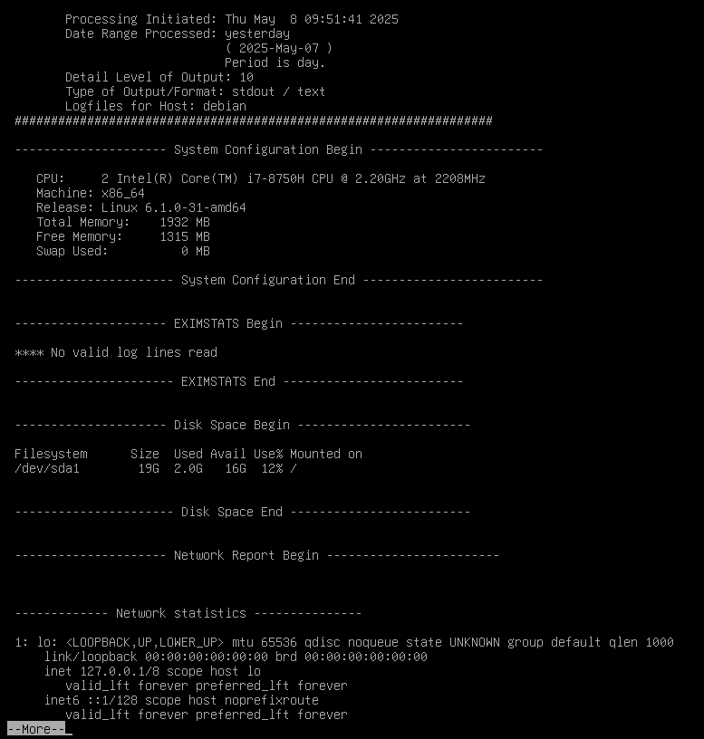

# How to use rsyslog and logwatch
- Both logwatch and rsyslog are log management tools in Linux, but they serve different purposes:
    - rsyslog: Collects, filters, and stores logs from different system components.
	- logwatch: Analyzes and summarizes logs to provide daily reports.

## 1. rsyslog: The Log Management System
- rsyslog is the default logging system on most modern Linux distributions. It replaces older logging systems like syslog and syslog-ng.

### How rsyslog Works
- It collects logs from various system services (e.g., SSH, authentication, kernel, etc.).
- It can filter, forward, and store logs in different files or send them to a remote log server.
- Logs are stored in /var/log/ by default.

### Key Configuration File
- The main configuration file for rsyslog is /etc/rsyslog.conf
- Additional configuration files are in /etc/rsyslog.d/

### Example: Logging SSH Access
1. Open the rsyslog configuration file:
    > sudo nano /etc/rsyslog.d/ssh.conf

    - add this line: auth,authpriv.*  /var/log/ssh.log

2. Restart rsyslog:
    > sudo systemctl restart rsyslog

    - Now, all authentication logs will be stored in /var/log/ssh.log.

3. Viewing Logs
    - Check logs in real-time:
    > sudo tail -f /var/log/syslog

4. View SSH logs:
    > sudo cat /var/log/auth.log

5. Forward Logs to a Remote Server
    - If you have a central log server, you can forward logs to it by adding this line in /etc/rsyslog.conf:
    > *.* @logserver.example.com:514

6. Then restart rsyslog to apply the changes.
    > sudo systemctl restart rsyslog

## 2. logwatch: Log Analysis and Reporting
- Logwatch is a log analysis tool that summarizes logs and sends reports via email or command-line. It helps you monitor system activity without manually checking logs.

1. Install logwatch
    > sudo apt update

    > sudo apt install logwatch -y

2. Running logwatch
    1. Running logwatch Manually
    - Generate a system report for the last day:
        > sudo logwatch --detail High --range yesterday --service all | more
        
        * Note
    2. Automating logwatch Reports (Email)
    - To make this work, an email-sending service has to be installed! (https://documentation.ubuntu.com/server/how-to/mail-services/install-postfix/index.html)
    - To receive daily reports via email:
        > sudo nano /etc/logwatch/conf/logwatch.conf
        - modify these settings:
            -  Output = mail
            - MailTo = admin@example.com
            - Detail = High

    - Restart logwatch:
        > sudo systemctl restart logwatch

3. Customizing Logwatch Reports
- Modify /etc/logwatch/conf/services/ to customize which logs logwatch analyzes.
- For example, to include only SSH logs:
    > sudo logwatch --service sshd --range today --detail High
    
